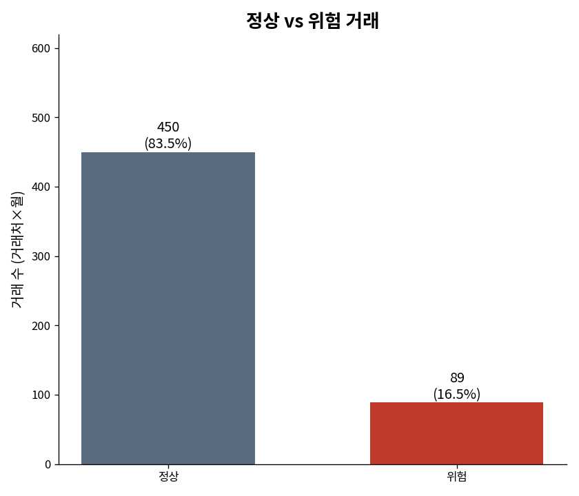
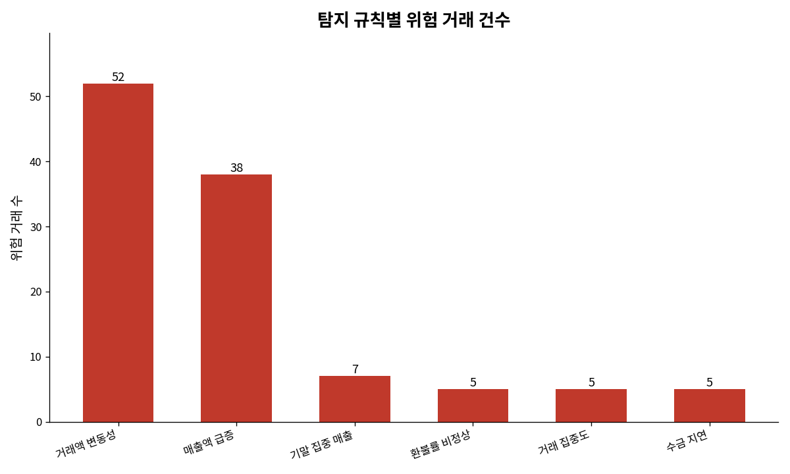

# sales-timing-risk-detector

**매출 인식 타이밍 위험 자동탐지 시스템** — ISA 540/330(회계추정 및 감사절차) 기반 위험 기반 감사

 

---

## 프로젝트 개요

회계감사에서 **매출 인식의 적절성**은 가장 중요한 검토 영역 중 하나입니다. 특히 "언제 매출로 잡느냐(인식 타이밍)"는 실적 조정·부정의 통로가 되기 쉬워, 감사인이 집중적으로 살피는 부분입니다.

본 프로젝트는 **국제감사기준 ISA 540(회계추정)** 및 **ISA 330(감사절차 수행 및 평가)** 의 위험 기반 접근을, 매출 데이터에 적용해 자동화한 것입니다. 매출 데이터를 입력받아 6가지 위험지표를 탐지하고, 규칙별 가중치로 위험 점수를 매겨 우선 검토 대상을 가려냅니다.

### 핵심 기능

- ✅ **6가지 이상탐지 규칙** 자동 실행
- ✅ **규칙별 가중치** 기반 위험 점수 산출
- ✅ **HTML 대시보드 리포트** 생성
- ✅ **시각화 차트**(PNG) 생성
- ✅ **정밀도/재현율** 성능 평가
- ✅ **단위테스트**로 규칙의 논리적 정확성 검증

---

## 탐지하는 6가지 위험지표

| # | 규칙 | 가중치 | 감사에서의 의미 |
|---|------|--------|---------|
| 1 | **기말 집중 매출** | 3 | 분기말·연말에 비정상적 매출 급증 → 기간 귀속 조작(밀어내기) 의심 |
| 2 | **환불률 비정상** | 3 | 매출 대비 환불률 15% 초과 → 가공매출 후 취소 등 진정성 의문 |
| 3 | **거래 집중도** | 2 | 월 매출의 50% 이상이 단일 거래처 → 거래 신뢰성 약화 |
| 4 | **수금 지연** | 2 | 미수금 비율 50%↑ 이면서 2천만원↑ → 매출 실현가능성 의심 |
| 5 | **거래액 변동성** | 2 | 거래처별 매출 편차가 극단적 → 비정상 거래 패턴 |
| 6 | **매출액 급증** | 1 | 전월 대비 300% 이상 증가 → 일시적 실적 부풀리기 신호 |

**위험 점수** = 걸린 규칙들의 가중치 합 → 점수가 높을수록 우선 검토

---

## 설치 및 사용

```bash
pip install pandas matplotlib

# 1) 합성 데이터 생성
python3 data/generate_data.py

# 2) 데이터 로드 & 기초 검증
python3 src/loader.py

# 3) 위험 점수 산출
python3 src/scorer.py

# 4) HTML 대시보드 생성
python3 src/report.py

# 5) 시각화 차트 생성
python3 src/charts.py

# 6) 탐지 성능 평가
python3 src/evaluate.py
```

결과물: `reports/risk_report.html`(대시보드), `reports/chart_*.png`(차트)

---

## 데이터에 대하여

실제 회사 매출은 공개할 수 없으므로, 감사에서 점검하는 매출 속성(년월, 거래처, 매출액, 환불액, 수금액, 미수금, 입력일시, 담당자)을 본뜬 **합성 데이터**를 사용합니다. 정상 거래 사이에 6가지 위험 유형을 의도적으로 심어 두었고(`is_anomaly` 컬럼 = 정답표), 탐지 규칙은 이 정답을 전혀 보지 않고 매출 속성만으로 판단합니다. 랜덤 시드를 고정해 누가 실행하든 같은 결과가 재현됩니다.

- 전체 거래: 576건 (정상 536 + 의도적으로 심은 이상 40)
- 거래처 50개 × 12개월

---

## 실행 결과 및 성능 평가

규칙 세트가 **89건**을 위험 거래로 탐지했습니다.

```
정밀도(Precision) : 28.1%   (찾은 것 중 실제 이상인 비율)
재현율(Recall)    : 62.5%   (정답 중 찾아낸 비율)
```

### 시각화 결과





### 이 결과를 어떻게 읽는가

이 도구는 **규칙 기반 1차 스크리닝 도구**입니다. 정밀도가 낮은 것은, 거래액 변동성·매출액 급증 같은 규칙이 "그물을 넓게 치는" 성격이라 정상 거래도 함께 잡기 때문입니다(위 차트에서 두 규칙의 적중 건수가 압도적으로 많은 이유입니다).

감사 관점에서는 **부정을 놓치는 것(미탐)이 헛걸림(오탐)보다 훨씬 치명적**이므로, 1차 스크리닝은 "넓게 걸러 사람이 다시 확인"하는 방향으로 설계됩니다. 이 도구는 감사인의 최종 판단을 대체하는 것이 아니라, **위험 점수가 높은 거래부터 우선 검토하도록 돕는 필터** 역할을 합니다.

동시에 이 프로젝트는 그 한계를 **정직하게 측정**했다는 점에 의미가 있습니다. 규칙의 성능을 정답과 비교해 정밀도·재현율로 정량화함으로써, 어디를 개선해야 할지 근거를 확보했습니다.

---

## 프로젝트 구조

```
sales-timing-risk-detector/
├── data/
│   ├── generate_data.py            # 합성 매출 데이터 생성
│   └── sample_sales_data.csv       # 생성된 데이터
├── src/
│   ├── loader.py                   # 데이터 로드 & 검증(대차평형 포함)
│   ├── rules.py                    # 6개 탐지 규칙
│   ├── scorer.py                   # 규칙별 가중치 기반 위험 점수 산출
│   ├── report.py                   # HTML 대시보드 생성
│   ├── charts.py                   # 시각화 차트(PNG) 생성
│   └── evaluate.py                 # 성능 평가 (정밀도/재현율)
├── tests/
│   └── test_rules.py               # 규칙 단위테스트 (12개)
├── reports/
│   ├── risk_report.html            # HTML 대시보드
│   ├── chart_normal_vs_flagged.png # 정상 vs 위험 차트
│   └── chart_by_rule.png           # 규칙별 건수 차트
├── requirements.txt
└── README.md
```

---

## 테스트 실행

```bash
$ python3 tests/test_rules.py

Ran 12 tests in 0.041s
OK
```

각 규칙이 의도대로 동작하는지, 정상 거래는 탐지되지 않는지를 12개 단위테스트로 검증합니다.

---

## 한계와 다음 단계

이 도구는 규칙 기반 1차 스크리닝으로, 위험 신호를 걸러줄 뿐 실제 부정 여부는 사람의 판단이 필요합니다. 규칙 임계값(예: 급증 배수, 변동성 기준)은 회사·산업에 따라 조정되어야 합니다. 향후 개선 방향으로는, 넓게 잡는 규칙의 임계값을 정교화해 **정밀도를 높이거나**, 놓치는 유형을 분석해 **재현율을 높이는** 작업, 그리고 계절성을 반영한 이상치 탐지 모델 도입 등을 고려할 수 있습니다.

---

## 자기소개서 연결 포인트

> **"매출 인식 타이밍의 감사 위험(ISA 540)을 직접 데이터로 구현해보며, 기말 집중·환불률·수금 지연 등 6가지 부정 위험 지표를 코드로 옮기고, 위험 점수 기반의 거래 우선순위 체계를 만들었습니다. 나아가 탐지 결과를 정답과 비교해 정밀도·재현율로 성능을 정량 평가하고, 그 한계와 개선 방향까지 정직하게 도출하며 데이터 기반 감사의 실제를 경험했습니다."**

---

## 라이선스

MIT License

---

**이 프로젝트는 신입공인회계사의 데이터 기반 감사 역량을 보여주기 위해 만들어졌습니다.**
